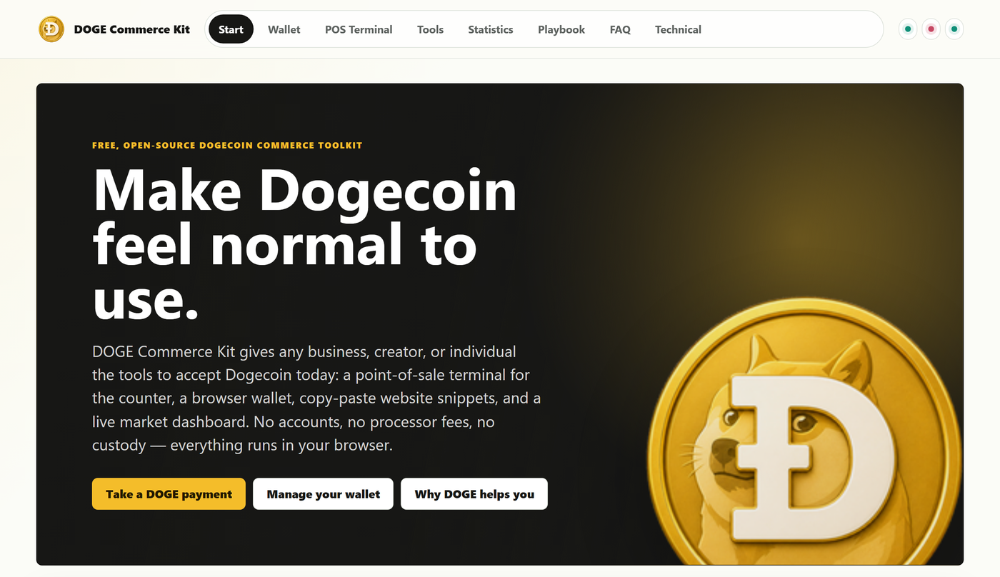
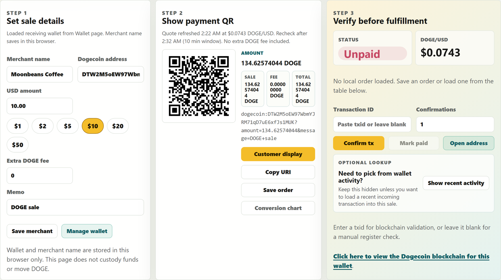
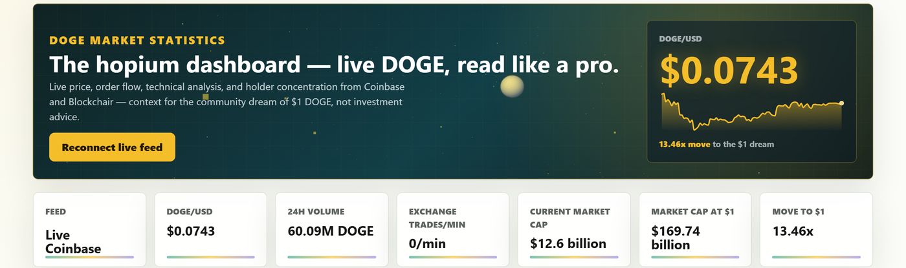
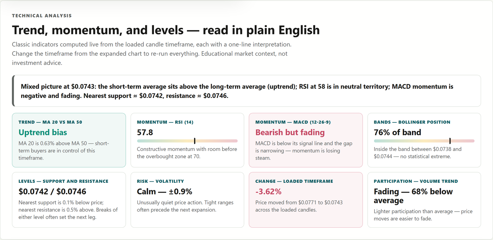
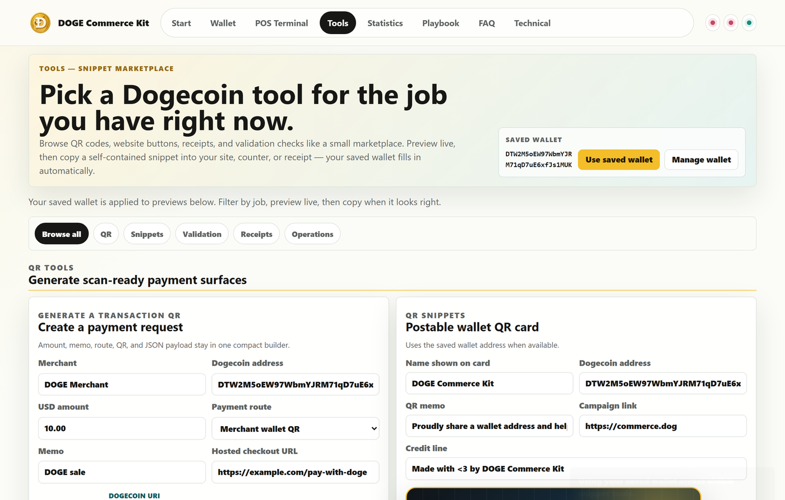
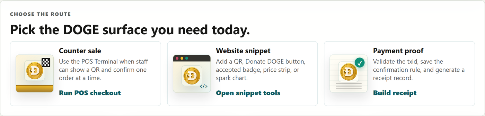

# doge-commerce-kit

**DOGE Commerce Kit** — the free, open-source Dogecoin commerce toolkit, live at [commerce.dog](https://commerce.dog). A consolidated Django site built around direct Dogecoin acceptance.



Everything runs in the browser against a stateless Django backend — no accounts, no processor fees, no custody:

- `Start` - what the kit is, the four tools at a glance, and role-based entry paths
- `POS Terminal` - built-in wallet setup (generate a new Dogecoin wallet with a one-time key backup, or paste your own address), quote sales in USD with quick-amount chips, show a scannable DOGE QR or a full-screen customer display, verify payment on chain, and keep an exportable local order ledger
- `Tools` - snippet marketplace: payment QR builder, postable wallet card, printable "Dogecoin accepted here" counter sign, accepted badge, donate button, live price and spark-chart snippets, website integration pieces, transaction validation, receipts, and checkout policy — all auto-filled from the saved wallet
- `Statistics` - live dashboard: Coinbase DOGE-USD price with animated sparkline over a three.js starfield, KPI strip, candles with moving averages, trade tape, plain-English technical analysis (RSI, MACD, Bollinger, support/resistance, volatility), capital map, and rich-list distribution
- `Playbook` - why-DOGE benefits, route picker, four-step checkout runbook, launch checklist, and printables (counter sign, cashier quick card)
- `FAQ` - plain-language merchant and builder answers with primary sources
- `Technical` - sticky section navigator, wallet key derivation, payment URI/QR reference, chain lookup config, copyable code blocks, reusable data files, webhook demo, and papers

The site stays inside a lawful adoption lane:

- no price promises
- no coordinated buying or selling
- no hidden paid promotion
- no fake merchant proof
- no custody of customer or merchant funds

Current adoption expansion is now expressed as lightweight kit examples inside the Playbook and Tools pages rather than a large multi-page campaign workflow.

## Screenshots

### POS Terminal — price in dollars, get paid in DOGE

Quote a sale in USD with quick-amount chips, show the customer a scannable QR
(or flip to a full-screen customer display), verify the payment on chain, and
keep a local order ledger.



### Live market dashboard

Real-time Coinbase price with an animated sparkline over a three.js starfield,
KPI strip, candles with moving averages, and a live trade tape.



Classic indicators — RSI, MACD, Bollinger position, support/resistance,
volatility — computed live from the loaded candles, each with a plain-English
read and a one-line market summary.



### Snippet marketplace

Copy self-contained website snippets, badges, receipts, and printable counter
signs that auto-fill from the wallet saved in the POS Terminal — where you can
generate a new wallet (with a one-time key backup) or paste your own address.



### Playbook

Checklists, printables, and a runbook that turn Dogecoin acceptance into a
counter-ready workflow.



## Deploy to Production (DigitalOcean droplet or any Docker host)

The compose stack ships two services: `web` (Django behind gunicorn, non-root,
health-checked) and `caddy` (TLS termination with automatic Let's Encrypt
certificates). The app port is bound to loopback only; all public traffic
enters through Caddy on 80/443.

1. Point A/AAAA records at the server for every hostname you want served, and
   open ports 80 + 443. The bundled config expects four: `commerce.dog`
   (canonical, serves the app) plus `www.commerce.dog`, `doge-commerce-kit.com`,
   and `www.doge-commerce-kit.com` (each gets its own certificate and redirects
   to the canonical). Adjust `DOGE_REDIRECT_DOMAINS` in `.env` for a different set.
2. Clone the repo and create the environment file:

   ```bash
   cp .env.example .env
   python3 -c "import secrets; print(secrets.token_urlsafe(50))"   # paste into DJANGO_SECRET_KEY
   ```

   The example file already targets production at `commerce.dog`
   (`DOGE_DOMAIN`, `DOGE_SITE_URL`, `LETSENCRYPT_EMAIL`) — adjust if you
   deploy elsewhere.

3. Launch:

   ```bash
   docker compose up -d --build
   ```

   Caddy obtains the certificate automatically on first request. Verify with
   `curl -I https://your-domain/health/`.

Production notes:

- The container refuses to boot with a missing or default `DJANGO_SECRET_KEY`.
- `/api/` endpoints are rate limited per client IP (`DOGE_API_RATE_LIMIT`,
  default 60/min per gunicorn worker).
- HSTS is on by default (`DJANGO_HSTS_SECONDS=31536000`); set it to `0` while
  testing DNS if needed.
- For real traffic, configure a Blockbook indexer (below) — the public
  BlockCypher demo fallback throttles quickly.
- Update flow: `git pull && docker compose up -d --build`.

## Run With Docker (local)

```powershell
cp .env.example .env   # set DJANGO_SECRET_KEY (any long random string) and DOGE_DOMAIN=localhost
docker compose up --build
```

With `DOGE_DOMAIN=localhost`, Caddy serves `https://localhost` using a
self-signed local certificate (accept the browser warning), and the app is
also reachable directly at `http://127.0.0.1:42069`.

To reproduce the build verification logs locally:

```powershell
$env:DOGE2MOON_SCRATCH = ".\verify-artifacts"
python tools\verify_build.py
```

Then visit:

```text
http://localhost:42069
```

### Dogecoin Blockchain Lookup Provider

Wallet balances, recent transactions, POS activity, and transaction validation can use a Blockbook-compatible Dogecoin indexer instead of a throttled public demo API:

```powershell
$env:DOGE_BLOCKBOOK_BASE_URL="https://your-dogecoin-indexer.example"
$env:DOGE_BLOCKCHAIN_PROVIDER_NAME="Your Dogecoin indexer"
$env:DOGE_BLOCKBOOK_API_KEY="optional-provider-key"
docker compose up --build
```

If `DOGE_BLOCKBOOK_BASE_URL` is not configured, the app keeps a short cached BlockCypher demo fallback for local testing. Set `DOGE_ENABLE_BLOCKCYPHER_FALLBACK=false` to disable the public fallback entirely.

## Run Locally

```powershell
python -m pip install -r requirements.txt
python manage.py runserver 42069
```

For the full test suite (browser + MiniRacer wallet/rate tests):

```powershell
python -m pip install -r requirements-dev.txt
python -m playwright install chromium
python manage.py test commerce.tests
```

Then visit:

```text
http://127.0.0.1:42069
```

## Project Structure

- `manage.py` - Django command entry point
- `doge2moon/` - Django project settings (production hardening lives here) and root URLs
- `commerce/` - consolidated site app
- `commerce/middleware.py` - per-IP rate limiting for `/api/` endpoints
- `commerce/templates/commerce/` - primary pages
- `commerce/static/commerce/css/site.css` - shared interface styling
- `commerce/static/commerce/js/site.js` - shared page tools (snippet builders, filters, code copy)
- `commerce/static/commerce/js/doge_tools.js` - wallet, POS, statistics, and technical-analysis logic
- `commerce/static/commerce/js/wallet_core.js` - client-side key derivation and transaction signing
- `commerce/static/commerce/js/stats_dashboard.js` - d3 price sparkline for the statistics header
- `commerce/static/commerce/js/stats_visuals.js` - three.js starfield accent behind the statistics header
- `commerce/static/commerce/vendor/` - self-hosted d3, topojson, and three.js
- `commerce/static/commerce/data/` - reusable JSON and CSV templates
- `Dockerfile` - production container build (non-root, healthcheck, tuned gunicorn)
- `docker-compose.yml` - production stack: web + Caddy TLS termination
- `Caddyfile` - automatic Let's Encrypt for commerce.dog
- `.env.example` - documented production environment template
- `docs/` - product spec, legal guardrails, release checklist, and README screenshots

The original static prototypes remain in the repository as source material, but the Django app is the primary runnable site.
